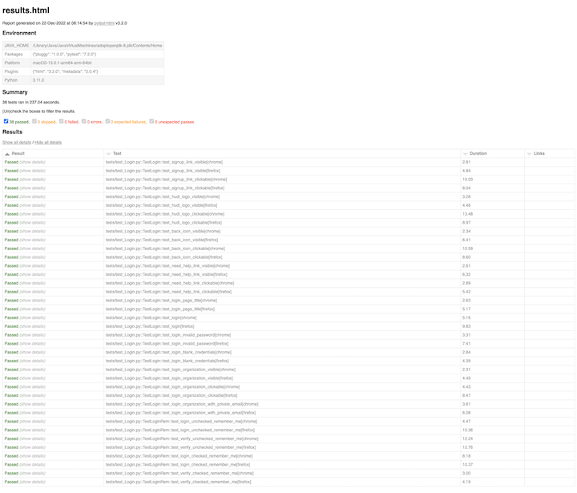

# Quality Engineering Project

Quality Engineering Project for positive/negative test cases to validate [hudl.com](https://www.hudl.com/) logging functionality.

The UI tests are designed to run on multiple browsers, the default browsers being Chrome and Firefox.

The project has been tested on the following resources:

* macOS Venture 13.0.1
* PyCharm 2022.3 (Community Edition)
* Python 3.11.0
* Chrome 108.0.5359.124 (Official Build) (arm64)
* Firefox 108.0.1 (64-bit)

## Requirements

Be sure to install the latest versions of Chrome and Firefox browsers.

The web drivers will be automatically downloaded and installed when you start the test environment.

Follow the instructions below to resolve dependencies:

```shell
# Install Python packages
pip install -r requirements.txt

# Set required environment variables
# In case you use Pycharm IDE, go to Run > Edit Configurations > Environment variables
# And in command line:
export USER_NAME="<email address>"
export PASSWORD="<your password>"
```

## Usage

This is intended as a quick reference for starting a test environment:

```shell
# In case you use Pycharm, go to Settings > Python Integrated Tools, and set pytest as a default runner
# Or run tests in command line with logs
pytest tests/test_Login.py -v

# Run tests in command line and create HTML report
pytest tests/test_Login.py -v --html=./results.html
```

## Screenshots



